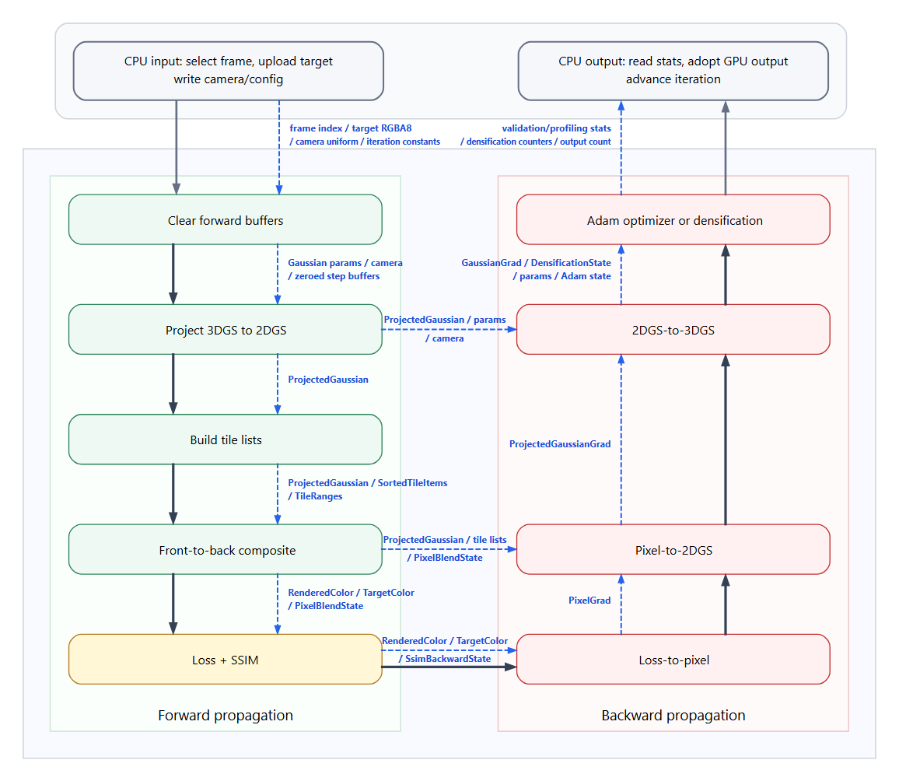
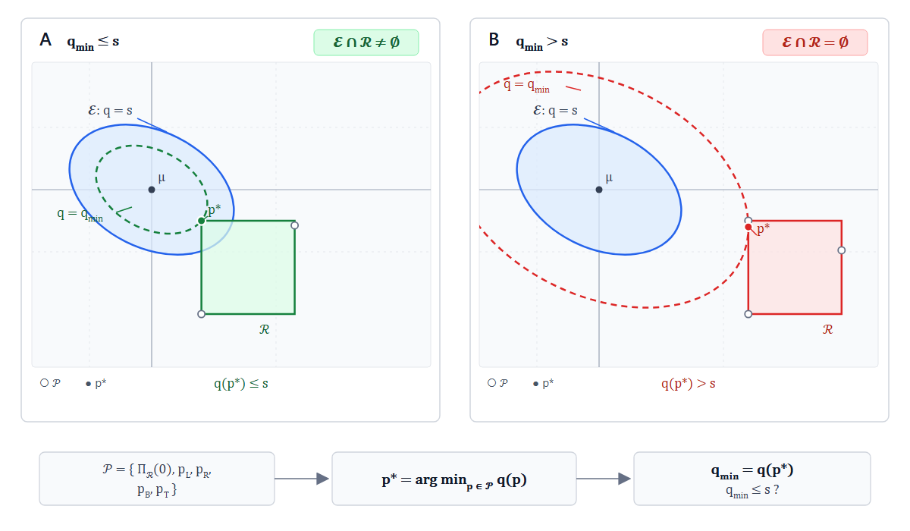

# Development Guide

[English](DEVELOPMENT.md) | [简体中文](DEVELOPMENT.zh-CN.md)

This document contains implementation-oriented information for contributors and maintainers. The main README files are intentionally focused on project users.

## Build Targets

- `vulkan_3dgs_core`: core static library.
- `vulkan_3dgs_app`: application entry from `apps/main.cpp`.
- `image_cache_tests`: image decode/cache tests.
- `training_ssim_tests`: DSSIM backward coefficient tests.
- `training_validation_tests`: two-level validation reduction tests.
- `tests/`: training service, scheduler, model I/O, image runtime, camera, and GPU selection tests.

The application output is `vulkan-3dgs.exe` on Windows and `vulkan-3dgs` on non-Windows platforms.

## Repository Layout

```text
apps/                                  application entry
src/app/                               Application, Window, and frame routing
src/viewer/                            viewer controller, panel, settings, and camera
src/graphics/                          PLY model and graphics Gaussian renderer
src/training/app/                      training controller and persisted settings
src/training/ui/                       training controls, diagnostics, GPU selector, and dialogs
src/training/core/                     GaussianTraining façade and compute services
src/training/cache/                    device-local image cache and upload ring
src/render/                            renderer base interfaces shared by both paths
src/context/                           Vulkan instance/device/queue setup
src/vulkan/                            reusable Vulkan resource wrappers
src/image/                             reusable image decode, disk cache, and host streaming
src/utils/                             shared logging, memory, and stb helpers
shaders/gaussian_compute_shader/slang/ graphics and sorting shaders
shaders/training_shader/slang/common/  shared training shader code
shaders/training_shader/slang/passes/  training compute passes
shaders/training_shader/slang/validation/ compact validation finalize pass
shaders/training_shader/slang/uint_radius/ radius atomic fallback variants
tests/                                 CPU and cache tests
```

## Main Architecture

`Application` is the composition root for the GLFW window, Vulkan context, renderer, frame routing, `ViewerController`/`ViewerPanel`, and `TrainingController`/`TrainingPanel`. `TrainingController` owns the training device, grouped persisted settings, dataset lifecycle, `GaussianTraining`, asynchronous worker, benchmark fallback, timer, immutable snapshots, and export. Starting training creates a validated, pointer-to-const `TrainingRunConfig`; worker policy, benchmark parameters, and Pure export use that snapshot rather than mutable UI settings. `TrainingPanel` owns training ImGui state and file dialogs and dispatches typed UI intents only through the controller. `ViewerController` owns the current model, camera/input policy, matrices, render settings, and viewer-settings persistence. `Application` neither mutates training lifecycle state nor parses either settings format.

The project has two separate Gaussian paths:

- `GaussianRenderer` is the PLY-rendering facade. Frame/swapchain synchronization, dual pipelines, packed model resources/descriptors, GPU radix sorting, and command recording are owned by focused `Graphics*` runtime modules.
- `GaussianTraining` owns dataset selection, training buffers, compute renderers, optimization, densification, validation, image caches, and PLY export.

The training path is not a wrapper around `GaussianRenderer`; it owns independent GPU resources and compute pipelines.

`GaussianTraining` remains the training façade. `TrainingValidationService` owns the three-slot validation readback ring and validation/history statistics, while `TrainingProfilingService` owns the timestamp query pool and timing accumulators. Renderers observe the profiling query pool but do not own it.
`TrainingFrameScheduler` owns Sequential/Random frame order, the seeded random-without-replacement stack, completion checks, and prefetch ordering; it has no Vulkan or image-cache dependency.
`TrainingModelIO` owns sparse/random host-side Gaussian initialization, scale and scene-extent estimation, and PLY serialization; GPU parameter upload/download remains with `GaussianTraining` and `TrainingBuffers`.
`TrainingImageRuntime` owns ImageStreamer, DeviceImageCache, image-source setup, target upload, cache-budget refresh and upload timeline state; it receives `TrainingBuffers` only for descriptor override or fallback target upload.
`TrainingStepExecutor` owns training command/fence resources and the prepare/main GPU execution sequence; `GaussianTraining` remains the façade for iteration, benchmark, dataset and model state.

The application maintains two logical device roles:

- the presentation device requires graphics, presentation to the current GLFW Surface, swapchain, push descriptors, anisotropy, and shader draw parameters; it owns normal rendering and ImGui;
- the training device never queries the Surface and requires only a compute queue, push descriptors, and buffer float32 atomic add from `VK_EXT_shader_atomic_float`; transfers use a dedicated queue when available or the compute queue otherwise.

The `Training` panel GPU selector and `--gpu` affect only the training device. Switching it releases existing training GPU resources and requires the dataset to be loaded again without recreating GLFW, ImGui, or the swapchain. Training `Buffer` instances must explicitly use queue-family indices from the training device instead of reading queue families from the global presentation `Context`.

Only the presentation device initializes the global Vulkan-Hpp dispatcher. A training device must not reinitialize it because device-level swapchain function pointers could otherwise be overwritten by a logical device that did not enable the swapchain extension.

Normal training runs through `TrainingController` on a `std::jthread`. The worker owns calls into `GaussianTraining`; ImGui reads a mutex-protected `TrainingUiSnapshot`. Non-Pure mode publishes a snapshot every 100 steps. Pure Training suppresses intermediate details, throttles presentation, measures wall time, and exports the configured PLY on completion. The GPU iteration itself remains synchronous at its prepare/main fence boundaries.

## Gaussian PLY Data

The normal renderer supports binary little-endian 3DGS-style PLY properties:

- position: `x`, `y`, `z`
- SH: `f_dc_0..2`, `f_rest_0..44`
- opacity: `opacity`
- scale: `scale_0..2`
- rotation: `rot_0..3`

Scale and opacity are restored from their stored parameterization, and covariance is generated from scale and quaternion rotation.

### Viewer camera and render profiles

Normal PLY rendering exposes `Legacy` and `SuperSplat Compatible` profiles. Both use the shared roll-free `CameraController` with Orbit/Fly, damping, larger-axis FOV, and bounds-fitted clipping planes. Profiles differ only in graphics rendering:

- Legacy uses the original 3-sigma exponential kernel and straight-alpha pipeline.
- SuperSplat Compatible uses a finite normalized kernel with radius `sqrt(8)`, premultiplied RGB, source-over alpha accumulation, and a `1/255` fragment contribution cutoff.

Two graphics pipelines provide the required static Vulkan blend states. A profile flag and selected SH band count are passed in `UniformBufferObject::renderSettings`; the graphics UBO and `gaussian_common.slang` layout must remain synchronized. This path is independent of all training shaders.

Camera reset and focus derive distance from the limiting horizontal/vertical half-FOV at the current framebuffer aspect ratio, with a small framing margin; they do not use a fixed world-space minimum distance. Loading a model or resetting the camera returns to Orbit mode. `GaussianModel` keeps separate bounds: percentile-trimmed, opacity-visible focus bounds for stable framing, and conservative full bounds expanded by each Gaussian's 3-sigma scale for near/far fitting. The original center-only bounds remain available for model transforms.

## Dataset Loading

The training loader accepts MipNeRF360/COLMAP-like layouts with:

- `sparse/0/cameras.bin` and `sparse/0/images.bin`, with supported fallback locations;
- an image directory such as `images_4`, `images_2`, `images_8`, or `images`;
- optional `points3D.bin` sparse points.

Actual source image dimensions are read from image metadata. COLMAP intrinsics are scaled to the selected image dimensions, and all training frames must use a consistent size.

Sparse points initialize position and color. Initial opacity, scale, rotation, and optimizer state are generated by the training implementation. When sparse points are unavailable, an optional random fallback can initialize the scene.

## Dataset Image Streaming

The image subsystem is separated from training so it can be reused by future image-processing modules.

- `ImageDiskCache` owns KTX2 chunk persistence, validation, recovery, and quota enforcement.
- `ImageStreamer` owns source registration, host `RGBA8` entries, request waiting, worker-thread prefetch, and LRU eviction.
- `GaussianTraining` chooses dataset frames and owns the streamer instance.
- `DeviceImageCache` owns training-specific device-local image slots and upload synchronization.

Images are stored as linear `RGBA8`, four bytes per pixel. Shader code unpacks target values on the GPU.

Host cache defaults:

```text
budget = min(available RAM * 10%, available RAM - 2 GiB)
```

An explicit non-zero host budget overrides the automatic value. If the full decoded dataset fits, all images are prefetched. Otherwise the cache uses request-driven loading, limited prefetch, and LRU eviction. Active `ImageHandle` references temporarily prevent eviction.

Disk cache defaults:

- KTX2 array chunks with 16 layers;
- each read publishes every layer in the loaded chunk to the host cache;
- 20 GiB quota;
- active-dataset and historical chunks are reported separately, with historical chunks evicted first when over quota;
- platform-specific user cache directory.

Device image cache behavior:

- one aligned storage-buffer slot per resident `RGBA8` image;
- `Streaming`, `Partial`, and `Full` modes;
- at least one slot;
- maximum allocation is the smaller of the aligned full-dataset slot size and one quarter of the device-local heap budget;
- normal reserve is `max(512 MiB, 15% of heap budget)`, capped at half the heap budget;
- pre-densification reserve is `max(1 GiB, 25% of heap budget)`, also capped at half;
- a three-slot persistently mapped staging ring is used when timeline semaphores are available;
- `VULKAN_3DGS_SYNC_IMAGE_UPLOAD=1` forces synchronous uploads.

The UI reports host, active/historical disk cache, device resident/slot/total, staging, upload, hit/miss, eviction, and memory-budget statistics.

## Training Flow

The training path is orchestrated by `GaussianTraining` and split into three compute renderers:

- `GaussianForwardRenderer`: projection, tile construction, sorting, and forward compositing;
- `GaussianBackwardRenderer`: loss, pixel gradients, 2D Gaussian gradients, 3D Gaussian gradients, and Adam;
- `GaussianDensificationRenderer`: clone, split, prune, opacity reset, and densification statistics.

It is separate from the graphics-based `GaussianRenderer`. The normal renderer consumes final PLY parameters and draws instanced quads. The training path explicitly builds tile lists in compute shaders and preserves forward intermediates so that backward can replay the same compositing path.

The diagram places both CPU boundaries inside one shared frame at the top: `CPU input` is on the left and `CPU output` is on the right. The middle is one U-shaped training iteration, with forward propagation descending on the left, Loss/SSIM at the bottom, and backward propagation rising toward the CPU output on the right. The Forward and Backward section names are placed below their respective pass columns. Pass boxes contain only algorithm stages; buffer reads, writes, preserved forward state, and CPU/GPU transfers are written directly on blue dotted data arrows instead of being placed in rows inside the pass or in separate data-box nodes.



The diagram is generated by Graphviz from the local, ignored `docs/training-flow.dot` source. The SVG remains the scalable source asset, while the document embeds the PNG for broader Markdown-preview compatibility. After editing the DOT source, regenerate both files under `docs/assets`.

The thick dark line is one continuous logical training path: the top-left CPU input points into the iteration, forward passes descend to the single `Loss + SSIM` evaluation, connect directly to `Loss-to-pixel`, and then rise through Pixel-to-2DGS, 2DGS-to-3DGS, and optimizer/densification before pointing upward into the top-right CPU output. On ordinary optimizer steps, the logical 2DGS-to-3DGS and Adam boxes are physically one fused dispatch. Blue dotted arrows are the data path. Their direction runs from the producer or retained state to the consumer, and their labels name the exact buffers or persistent state carried by that dependency.

At the CPU boundary, the incoming dotted arrow carries the selected frame index, packed target RGBA8, camera uniform, and iteration constants. The outgoing dotted arrow carries compact validation/profiling statistics, densification counters, and the output Gaussian count; it does not imply a full Gaussian-parameter download. Inside the iteration, the projection writes `ProjectedGaussian`; one dotted arrow carries it into tile construction, while another carries the preserved projection state into 2DGS-to-3DGS. Graphviz uses explicit ranks for the two columns: the forward chain determines vertical layers, while backward logic edges are excluded from rank calculation, so `B4` stays above `B1` and the real arrows still point continuously upward from `B1` to `B4`.

### 1. Dataset, camera, and target

`TrainingDatasetLoader` reads COLMAP cameras, poses, and optional `points3D.bin`. It uses the actual dimensions of the selected image files and scales `fx/fy/cx/cy` to those dimensions. Therefore `params.width/height`, camera data, and the target buffer must describe the same resolution. `downscale` affects image-directory selection and intrinsic scaling; shaders do not divide the resolution a second time.

Frame selection is controlled by `TrainingScheduleConfig`:

- `Sequential`: `(current + 1) % dataset.size()` with no fixed stop;
- `Random`, exposed in the UI as `3DGS Random`: a seeded random-without-replacement viewpoint stack. The stack is refilled after it is exhausted. The default total is 30000 iterations, matching the reference 3DGS schedule.

`ImageStreamer` stores linear `RGBA8` images on the host. It can recover KTX2 chunks or decode source files; `DeviceImageCache` uploads the selected target into an aligned device-local storage-buffer slot. Shader binding 7 reads packed `uint` pixels and unpacks them to `[0, 1]` on the GPU. The training loop does not convert every target pixel to float on the CPU and does not keep the whole dataset resident on the GPU.

The camera is stored as `TrainingForwardCamera`, 15 `vec4` values (240 bytes): three 4x4 matrices followed by `viewport`, `focalTan`, and `cameraPosition`. It is bound as a uniform buffer at binding 11.

### 2. Parameterization and GPU data structures

The training path stores unconstrained parameters and applies activations in Slang. C++ and Slang structures are 16-byte aligned and checked with `static_assert`.

| Structure | Layout and size | Purpose |
| --- | --- | --- |
| `GaussianTrainParam` | position/opacity, scale, rotation, and channel-aligned `sh[12]`; 15 `vec4`, 240 B | Trainable Gaussian parameters |
| `GaussianGrad` | Same layout as `GaussianTrainParam`, 240 B | Accumulated gradient |
| `AdamState` | Two `GaussianGrad` values, 480 B | First and second Adam moments |
| `ProjectedGaussian` | `centerRadius`, `conicOpacity`, `color`; 48 B | Camera-space 2D projection |
| `ProjectedGaussianGrad` | Same three `vec4` values, 48 B | 2D gradient accumulated by pixels |
| `PixelGrad` | One `vec4`, 16 B | Per-pixel RGB loss gradient |
| `PixelBlendState` | transmittance, alpha, processed count, contributor count; 16 B | Forward state replayed by backward |
| `GaussianDensificationState` | screen-gradient sum/count and max radius; 16 B | Densification statistics |
| `SsimBackwardState` | Three `vec4` values, 48 B | Linearized SSIM backward coefficients |

For Gaussian `i`:

```text
opacity_i = sigmoid(positionOpacity_i.w)
scale_i   = exp(scale_i.xyz)
q_i       = normalize(rotation_i)
R_i       = quaternionToMatrix(q_i)
Sigma3D_i = R_i * diag(scale_i^2) * R_i^T
```

`scale` is therefore not a world-space radius, and the stored quaternion is not required to be normalized after every optimizer write. Projection normalizes it; optimization updates the raw values. Opacity is stored as a logit.

### 3. Prepare: projection and per-Gaussian tile count

The independent `prepareCommandBuffer_` records `projectGaussians()`, `clearTileRanges()`, `countTileCoverage()`, and `prefixGaussianTileRanges()`, followed by a 16-byte counter copy to a persistently mapped host-coherent readback buffer. There is no unified forward clear: composite fully overwrites rendered color and pixel blend state, loss fully overwrites per-pixel loss, Gaussian prefix overwrites the consumed counter field, and Gaussian gradients are cleared immediately before backward accumulation.

`train_forward_project.comp.slang` handles one Gaussian per invocation. With model, view, and projection matrices:

```text
p_model  = model * [p, 1]
p_camera = view  * p_model
p_clip   = projection * p_camera
ndc      = p_clip.xyz / p_clip.w
```

Gaussians with `camera.z <= 0.2` are invisible. The covariance is projected by the camera Jacobian:

```text
Sigma_camera = V * Sigma_world * V^T
J = [ fx/z,   0, -fx*x/z^2 ]
    [  0,  fy/z, -fy*y/z^2 ]
    [  0,    0,       0    ]
Sigma_pixel = (J * Sigma_camera * J^T)[0:2, 0:2] + 0.3 I
```

`x/z` and `y/z` are clamped to `1.3 * focalTan`. The backward path records a gradient mask so a clamped direction does not receive an invalid position gradient.

For `Sigma_pixel = [[a0,b0],[b0,c0]]`, `det=a0*c0-b0*b0`, the stored conic is:

```text
conic = [c0/det, -b0/det, a0/det]
```

`ProjectedGaussian.conicOpacity` stores `A, B, C, opacity`. The radius is the ceil of three standard deviations from the maximum eigenvalue. SH is evaluated in the current view direction as `max(evaluateSH(sh, direction) + 0.5, 0)`; `activeSHDegree` controls which coefficients are active.

#### Gaussian ellipse and rectangle intersection

The problem is purely geometric: determine whether an ellipse defined by a positive-definite quadratic form intersects an axis-aligned rectangle.

##### Quadratic form and effective support

Let the ellipse center be $\boldsymbol\mu$, let $\mathbf M$ be a symmetric positive-definite matrix, and define $\boldsymbol\delta=\mathbf p-\boldsymbol\mu$:

$$
\mathbf M
=
\begin{bmatrix}
A & B \\
B & C
\end{bmatrix},
\qquad
\boldsymbol\delta =
\begin{bmatrix}
\Delta x \\
\Delta y
\end{bmatrix}
= \mathbf p-\boldsymbol\mu.
$$

The conic quadratic is

$$
q(\boldsymbol\delta)
=\boldsymbol\delta^T\mathbf M\boldsymbol\delta
=A\Delta x^2+2B\Delta x\Delta y+C\Delta y^2.
$$

Let $\rho>0$ be the Gaussian amplitude. Its contribution function is

$$
g(\boldsymbol\delta)=\exp\!\left(-\frac{1}{2}q(\boldsymbol\delta)\right),
\qquad
f(\boldsymbol\delta)=\rho\,g(\boldsymbol\delta).
$$

For a threshold $\tau>0$, the condition $f\ge\tau$ is equivalent to

$$
\rho\exp\!\left(-\frac{q}{2}\right)\ge\tau
\quad\Longleftrightarrow\quad
q\le s,
\qquad
s=2\ln\!\left(\frac{\rho}{\tau}\right).
$$

If $\rho<\tau$, then $s<0$, while a positive-definite quadratic satisfies $q\ge0$; no point can meet the threshold. If $\rho=\tau$, then $s=0$ and the effective region degenerates to the center point. If $\rho>\tau$, then $s>0$ and the effective support is the non-degenerate ellipse

$$
\mathcal E=\{\boldsymbol\delta\mid q(\boldsymbol\delta)\le s\}.
$$

Positive definiteness requires

$$
A>0,
\qquad C>0,
\qquad \det(\mathbf M)=AC-B^2>0.
$$

These conditions make $q$ strictly convex and, for $s>0$, make $q=s$ a finite ellipse.

##### Constrained minimum over a rectangle

Let the axis-aligned rectangle in coordinates relative to the ellipse center be

$$
\mathcal R=[x_{\min},x_{\max}]\times[y_{\min},y_{\max}].
$$

Define the minimum quadratic value over the rectangle as

$$
q_{\min}
=\min_{\substack{
x_{\min}\le x\le x_{\max}\\
y_{\min}\le y\le y_{\max}
}}
\left(Ax^2+2Bxy+Cy^2\right).
$$

Because $\mathbf M$ is positive definite, $q$ is strictly convex. Its minimum over the rectangle can only occur at the unconstrained minimum or at a stationary point of the restriction of $q$ to one of the four edges:

1. The unconstrained minimum is $\boldsymbol\delta=(0,0)^T$. If it is outside the rectangle, use

   $$
   \boldsymbol\delta_0=\Pi_{\mathcal R}(\mathbf 0),
   $$

   where $\Pi_{\mathcal R}$ is component-wise projection onto $\mathcal R$. This is the point in the rectangle closest to the origin.

2. On a vertical edge with fixed $x$, the stationary coordinate is

   $$
   \frac{\partial q}{\partial y}=2Bx+2Cy=0
   \quad\Longrightarrow\quad
   y^*(x)=-\frac{B}{C}x.
   $$

   Evaluate this expression at $x=x_{\min}$ and $x=x_{\max}$, projecting $y^*$ onto $[y_{\min},y_{\max}]$.

3. On a horizontal edge with fixed $y$, the stationary coordinate is

   $$
   \frac{\partial q}{\partial x}=2Ax+2By=0
   \quad\Longrightarrow\quad
   x^*(y)=-\frac{B}{A}y.
   $$

   Evaluate this expression at $y=y_{\min}$ and $y=y_{\max}$, projecting $x^*$ onto $[x_{\min},x_{\max}]$.

Equivalently, the candidate set is

$$
\begin{aligned}
\mathcal P=\{&\boldsymbol\delta_0,\\
&(x_{\min},\Pi_{[y_{\min},y_{\max}]}(-Bx_{\min}/C)),\\
&(x_{\max},\Pi_{[y_{\min},y_{\max}]}(-Bx_{\max}/C)),\\
&(\Pi_{[x_{\min},x_{\max}]}(-By_{\min}/A),y_{\min}),\\
&(\Pi_{[x_{\min},x_{\max}]}(-By_{\max}/A),y_{\max})\}.
\end{aligned}
$$

Therefore,

$$
q_{\min}=\min_{\mathbf p\in\mathcal P}q(\mathbf p).
$$

If the minimum occurs at a corner, the projected candidate from at least one adjacent edge lands on that corner. No separate corner enumeration is therefore required. The ellipse and rectangle intersect exactly when

$$
q_{\min}\le s.
$$

If $q_{\min}>s$, the rectangle and ellipse are strictly disjoint.

The shader uses an equivalent reduced evaluation. If the rectangle contains the Gaussian center, then $q_{\min}=0$ and the tile is accepted immediately. Otherwise the constrained minimizer must lie on the rectangle boundary, so only the four edge-stationary candidates are evaluated. The Gaussian-invariant ratios $-B/A$ and $-B/C$ are computed once before the tile loop rather than divided again for every edge of every tile.

##### Visual example

The following figure treats $q(\boldsymbol\delta)=\text{constant}$ as a family of concentric ellipses expanding outward from the Gaussian center. For a given rectangle, the candidate set $\mathcal P$ contains the projection of the origin onto the rectangle and the one-dimensional stationary point on each edge. Selecting the candidate $\mathbf p^*$ with the smallest quadratic value is equivalent to finding the first expanding level ellipse that touches the rectangle.



In the left panel, the green first-contact contour lies inside the blue threshold ellipse $q=s$. Therefore $q_{\min}\le s$, and the rectangle intersects the effective support. In the right panel, the red first-contact contour lies outside the threshold ellipse. Therefore $q_{\min}>s$, and the two regions are strictly disjoint. Hollow points are edge candidates; the solid point is the selected $\mathbf p^*$.

The figure also shows why the Euclidean-nearest point in the rectangle is insufficient: quadratic level sets can be rotated and have different scales along their principal axes. The quantity that must be minimized is $q$, not ordinary circular distance.

##### Finite search domain and threshold ellipse

The Gaussian function has infinite support over the plane, while the threshold $\tau$ restricts its effective support to the finite ellipse $\mathcal E$. If an additional finite search rectangle $\mathcal B$ is introduced, the region actually considered is

$$
\mathcal E\cap\mathcal B.
$$

The constrained minimum determines whether $\mathcal E$ intersects a local rectangle. The finite search domain determines which local rectangles are examined at all. The former is an exact convex-optimization test; the latter is a truncation assumption applied to an infinite-support function.

The implementation starts with the existing scalar 3-sigma tile bounds. For a finite positive-definite conic it also computes a tighter axis-aligned bound of the threshold ellipse. Let

$$
\bar{s}=\max(0,s+\varepsilon),
\qquad
D=AC-B^2,
$$

where $\varepsilon$ is the same numerical tolerance used by the final intersection comparison. The maximum coordinate excursions of $q\le\bar{s}$ are

$$
r_x=\sqrt{\frac{\bar{s}C}{D}},
\qquad
r_y=\sqrt{\frac{\bar{s}A}{D}}.
$$

For tile size $T$, center coordinate $\mu$, and axis extent $r$, the conservative tile interval covering all pixel-center rectangles is

$$
t_{\min}=\left\lceil\frac{\mu-r-(T-1)}{T}\right\rceil,
\qquad
t_{\max}^{\mathrm{exclusive}}=\left\lfloor\frac{\mu+r}{T}\right\rfloor+1.
$$

The X/Y intervals are clamped to the image tile grid and intersected with the original 3-sigma bounds. This can only reduce the tiles on which the exact quadratic test runs; it does not enlarge or replace the existing finite search domain. Non-finite or non-positive-definite conics skip the tight-bound calculation and remain conservatively retained inside the original bounds.

#### Tile-pair construction details

`train_forward_tile_count.comp.slang` first creates shader-local culling data for one Gaussian: center/conic values, validity, the precomputed edge ratios, threshold plus tolerance, and the intersection of the 3-sigma and threshold-ellipse tile bounds. No extra storage buffer is allocated for this structure. The pass writes one `uint2` in `gaussianTileRanges` per Gaussian: `.y` is that Gaussian's exact retained tile count and `.x` is initially zero. It performs no per-tile atomic increment. The `train_forward_gaussian_prefix_*` passes run a hierarchical 256-element exclusive scan. The first level writes each Gaussian's local offset and one block sum per 256 Gaussians; additional scratch levels recursively scan those block sums until the top level fits in one workgroup. Offset-add passes then propagate parent offsets down through scratch and finally into `gaussianTileRanges[i].x`. The top pass writes the total pair count to binding 9 for the 16-byte CPU readback. Scratch capacity is allocated as the sum of all hierarchy levels, so the same path works across the 256- and 65536-Gaussian boundaries.

During main emit, one invocation owns one Gaussian and writes its retained pairs contiguously to `[range.x, range.x + range.y)`. Count and emit independently reconstruct the same shader-local culling data and call the same bounds and exact-ellipse helpers, so the local write count matches the prefixed count without an atomic cursor. After the two stable radix passes, `train_forward_tile_range_boundaries.comp.slang` compares adjacent sorted high keys and writes tile start/end boundaries. `train_forward_tile_sort.comp.slang` converts those boundaries to `[start,count]` and leaves empty tiles zeroed. The boundary pass explicitly covers the end sentinel and also handles zero or one tile item.

### Training shader pass catalogue

The following table follows the current recording order. Unless noted otherwise, passes use `numthreads(256,1,1)` and dispatch over Gaussian, pixel, or partial counts. Forward composite and pixel-to-2DGS use tile-sized `numthreads(16,16,1)` workgroups.

| Pass | Stage | Inputs | Output / role |
| --- | --- | --- | --- |
| `train_forward_project.comp.slang` | prepare | parameters, camera | Writes `ProjectedGaussian` and screen-radius statistics |
| `train_forward_tile_clear.comp.slang` | prepare | tile ranges | Clears per-tile start/end fields for later range rebuild |
| `train_forward_tile_count.comp.slang` | prepare | projected, Gaussian ranges | Precomputes culling invariants, intersects 3-sigma and threshold-ellipse bounds, applies the exact tile test, and writes the per-Gaussian count |
| `train_forward_gaussian_prefix_ranges.comp.slang` | prepare | Gaussian counts, scratch | Per-block exclusive scan and first-level block sums |
| `train_forward_gaussian_prefix_scratch.comp.slang` | prepare | prefix scratch | Recursively scans one hierarchy level and emits its parent sums |
| `train_forward_gaussian_prefix_top.comp.slang` | prepare | top prefix level, counter | Scans the top level and writes total tile-item count |
| `train_forward_gaussian_prefix_add_scratch.comp.slang` | prepare | child/parent prefix levels | Propagates parent offsets into child scratch levels |
| `train_forward_gaussian_prefix_add_ranges.comp.slang` | prepare | Gaussian ranges, first prefix level | Adds global block offsets to Gaussian starts |
| `train_forward_tile_emit.comp.slang` | main | projected, Gaussian ranges | Contiguously writes Gaussian indices, depth/tile keys, and sort indices |
| `train_forward_tile_gather_high.comp.slang` | main | high key, sort indices | Gathers high keys after low-key sorting |
| `train_forward_tile_gather_items.comp.slang` | main | unsorted items, sort indices | Produces final sorted item array |
| `train_forward_tile_range_boundaries.comp.slang` | main | sorted high keys/indices | Writes start/end at adjacent tile-key boundaries |
| `train_forward_tile_sort.comp.slang` | main | tile start/end boundaries | Converts boundaries to `[start,count]` and clears empty tiles |
| `train_forward.comp.slang` | forward | projected, sorted items, ranges | Direct per-pixel front-to-back composite |
| `train_forward_workgroup.comp.slang` | forward | same | Shared-memory composite in batches of 256 |
| `train_loss.comp.slang` | loss | rendered, target, blend | Per-pixel loss, SSIM state, pixel validation partial |
| `train_backward_clear.comp.slang` | backward fallback | gradient buffers | Compute fallback for clearing Gaussian and projected gradients |
| `train_backward_loss_to_pixel.comp.slang` | backward | rendered, target, SSIM state | Writes per-pixel RGB loss gradients |
| `train_backward_pixel_to_2dgs*.comp.slang` | backward | pixel gradients, tiles, blend | Reverse composite replay and atomic 2D gradients |
| `train_backward_tile_gaussian_atomic.comp.slang` | backward experimental | same | Tile/Gaussian work distribution with global atomic output |
| `train_backward_vksplat_per_splat.comp.slang` | backward experimental | same | Per-Splat wavefront traversal with dynamic subgroup-aligned batches |
| `train_backward_vksplat_tensor.comp.slang` | backward experimental | same | 16-Gaussian shared pair-derivative batches and per-Gaussian/tile reduction |
| `train_backward_2dgs_to_3dgs.comp.slang` | backward | parameters, projected gradients | Chain-rule position/opacity/scale/rotation/SH gradients |
| `train_backward_2dgs_to_3dgs_optimizer.comp.slang` | backward default | parameters, projected gradients, Adam | Fused projection backward, densification-state update, and Adam |
| `train_densify_clear.comp.slang` | densification | counters | Clears output and statistics counters |
| `train_densify_prune.comp.slang` or `train_densify_prune_uint_radius.comp.slang` | densification | parameters, Adam, state | Clone/split/keep/prune and output append |
| `train_densify_dispatch.comp.slang` | densification | output counter | Builds indirect dispatch for the real output count |
| `train_opacity_reset.comp.slang` | densification | densified params/Adam/counter | Resets opacity over the real output count |
| `train_optimizer.comp.slang` | main tail | parameters, gradients, Adam | Adam update only |
| `validation/train_gaussian_validation.comp.slang` | main tail | parameters, optional densification counter | Classifies non-finite Gaussian fields and writes one partial per 256 Gaussians |
| `validation/train_validation_finalize.comp.slang` | main tail | pixel/Gaussian partials | Reduces to the 112-byte final validation result |

The pixel, tile-atomic, Per-Splat, and Tensor files implement the same projected-gradient result with different work distribution and reduction. `train_densify_prune_uint_radius.comp.slang` is only the radius representation fallback when float min/max atomics are unavailable; it does not define a different densification rule. CMake also compiles `train_project.comp.slang`, `train_pack_render_buffer.comp.slang`, and `train_densify_finalize_prune.comp.slang` for legacy, preview, or compatibility pipelines; the specialized renderer passes in this table are the ones recorded by the current `GaussianTraining::trainStep()`.

## Forward, Loss, And Optimizer

The main command first emits each Gaussian's tile items into its prefixed contiguous range, performs two stable 32-bit radix passes for the semantic `(tile, depth)` key, gathers the final sorted items, rebuilds tile ranges from adjacent sorted keys, and composites 16x16 tiles. Each tile item is one `uint` containing only the Gaussian index. The forward equation is:

```text
alpha       = clamp(opacity * exp(power), 0, 0.99)
color      += T * alpha * gaussianColor
alphaSum   += T * alpha
T          *= 1 - alpha
renderAlpha = 1 - T
```

Each pixel runs the sample test for the sorted Gaussian indices retained by the whole-tile conservative test. Only `power <= 0` and `alpha >= 1/255` contribute. Processing stops when `T * (1-alpha) < 1e-4`. The workgroup-shared kernel loads up to 256 projected Gaussians per batch but preserves the direct kernel's order and thresholds. `PixelBlendState` stores final transmittance, accumulated alpha, processed sorted-prefix length, and contributor count.

The loss is:

```text
L1_pixel = (|R-T| + |G-T| + |B-T|) / 3
L_pixel  = ((1-w) * L1_pixel + w * (1-SSIM_pixel)) / pixelCount
```

SSIM uses an 11x11 Gaussian window with sigma 1.5, `C1=0.0001`, and `C2=0.0009`. Loss and loss-to-pixel use 16x16 workgroups that cooperatively cache the center region plus a five-pixel halo as a 26x26 shared-memory array. Precomputed separable Gaussian weights replace per-sample `exp()`, while out-of-image halo entries remain zero as in the original implementation. `SsimBackwardState` stores linearized coefficients so pixel backward does not nest a complete SSIM-window calculation inside every window.

Pixel-to-2DGS traverses each pixel's `processedCount - 1 ... 0` prefix. Given final transmittance `T_after`, sample alpha `a_i`, color `c_i`, and reverse suffix color:

```text
T_before = T_after / max(1 - a_i, 1e-6)
dL/dc_i  = dL/dpixelColor * (T_before * a_i)
dL/da_i  = dot(dL/dpixelColor, T_before * (c_i - suffixColor))
suffixColor = a_i*c_i + (1-a_i)*suffixColor
```

For `power = -0.5*(A*dx^2 + 2B*dx*dy + C*dy^2)`, the packed conic derivatives are:

```text
dL/dA       = dL/dpower * (-0.5 * dx * dx)
dL/dB       = dL/dpower * (-0.5 * dx * dy)
dL/dC       = dL/dpower * (-0.5 * dy * dy)
dL/dopacity = dL/dalpha * coverage
```

`B` is stored once and expanded as a symmetric off-diagonal term by `backwardConicToCovariance()`. Writing `-dx*dy` here would double that covariance-chain contribution. Atomics cover only nine differentiable values: center XY, conic/opacity XYZW, and RGB. Depth, integer screen radius, and color padding remain zero and are not accumulated.

The training panel exposes `Auto (Adaptive)`, `Direct`, `Workgroup Shared`, `Subgroup`, `Tile Gaussian Atomic`, `VkSplat Per-Splat`, and `VkSplat Tensor` Pixel-to-2DGS paths. Unsupported explicit modes fall back to Direct. Auto currently chooses only between Direct and subgroup-adaptive replay; it does not select a VkSplat path. If Vulkan does not report compute-stage BASIC and SHUFFLE subgroup operations, both Auto and a requested Subgroup mode fall back to Direct. On supported devices, Auto computes the subgroup's actual maximum `processedCount`: when it is no larger than the native subgroup width, each valid lane uses the direct reverse loop; longer prefixes are eligible for subgroup broadcast/reduction. The second condition is subgroup utilization,

```text
sum(valid-lane processedCount) /
    (validPixelLaneCount * max(valid-lane processedCount))
```

and the UI control `Auto Min Subgroup Utilization` defaults to `0.5`. A longer subgroup whose utilization falls below this threshold also uses Direct because synchronized broadcast rounds would mostly execute inactive candidate slots. Out-of-image lanes in partial edge tiles are excluded from the denominator. In each subgroup reverse item, every lane processes the same broadcast Gaussian while retaining independent pixel transmittance and suffix state. The subgroup first reduces the integer contribution count. If the total is zero, it skips all nine floating-point gradient reductions; otherwise wave shuffles reduce those components and lane zero performs one atomic accumulation for that Gaussian. This changes floating-point summation order but preserves each pixel's reverse traversal, thresholds, and gradient formula.

Per-Splat launches 128 threads per tile and chooses a subgroup-aligned Gaussian batch near `sqrt(rangeCount * 256)`, capped at 128. Tensor uses a 16x16 tile, fixed batches of 16 Gaussians, roughly 45 KiB shared memory, shared Gaussian-pixel pair derivatives, and nine final float atomics per Gaussian/tile. No Thompson-sampling scheduler is implemented; select these modes explicitly and check the UI active-mode line for fallback.

Before backward accumulation, `GaussianBackwardRenderer` records `vkCmdFillBuffer` over the active `ProjectedGaussianGrad` prefix. It also clears `GaussianGrad` when optimizer is disabled or the separate projection/optimizer path is active; ordinary fused steps do not clear or write that array. Buffer barriers make transfer writes visible to compute shader reads and writes. `train_backward_clear.comp.slang` remains available as a compute fallback and can be forced with `VULKAN_3DGS_COMPUTE_BACKWARD_CLEAR=1`; the existing `Backward clear` timestamps enclose whichever path is active.

Tile count and emit use the same conservative ellipse-versus-pixel-rectangle test. A tile is omitted only when the minimum conic quadratic over its valid pixel-center rectangle proves that opacity is below the `1/255` contribution threshold everywhere. The original projected 3-sigma radius remains unchanged for densification and screen-size logic.

Forward compositing provides `Direct` and `Workgroup Shared` modes. The shared mode is the default and cooperatively loads each tile's sorted projected Gaussians in batches of 256 while preserving every pixel's front-to-back order, alpha threshold, transmittance termination, and `processedCount`.

Training uses separate prepare and main command buffers with per-submit fences. The CPU still waits for the prepare tile count because buffer overflow must be resolved before emit, sort, composite, and optimizer execute, but it no longer uses queue-wide `waitIdle()` calls that can include unrelated queue work. The vendored radix sorter supports an indirect count, but its maximum-capacity dispatch does not provide overflow-conditional execution for the rest of the training graph.

Densification keeps parameter, Adam, and validation-partial buffers as ping-pong storage instead of recreating both sides after every adopt. Per-Gaussian scratch buffers grow geometrically by 1.5x and are then rounded to 16384-Gaussian chunks, reducing repeated rebuilds as the active count rises. The 64-byte densification counters use a persistent mapped readback, densification state is reset with one GPU fill, and opacity reset dispatches indirectly from the actual output count rather than the workspace capacity.

The 2DGS-to-3DGS stage applies the analytic chain `conic -> Sigma_pixel -> Sigma_world -> scale/rotation`, `center/depth -> camera/object position`, `opacity -> sigmoid(rawOpacity)`, and `color -> SH(viewDirection)`. It also accumulates screen-space center-gradient magnitude into `GaussianDensificationState`. Ordinary optimizer steps use the fused `train_backward_2dgs_to_3dgs_optimizer.comp.slang`, which keeps `GaussianGrad` local and applies Adam immediately. Optimizer-disabled/densification steps and `VULKAN_3DGS_SEPARATE_PROJECTION_OPTIMIZER=1` use the separate gradient pass; the latter then runs `train_optimizer.comp.slang`. The full gradient buffer remains allocated for these paths, so fusion has not eliminated all gradient VRAM. The former per-contribution `GaussianVisibilityState` buffer is no longer part of the implementation because no training pass consumes those statistics.

The Adam-style optimizer has independent learning rates for position, SH DC/rest, opacity, scale, and rotation. The CPU computes the current position schedule, scene-extent scale, `(1-beta)` values, and both bias-correction reciprocals once per iteration and passes them through push constants; the shader no longer repeats `pow()` and schedule evaluation for every Gaussian. The schedule and defaults still mirror the reference 3DGS behavior.

## Training Buffers

`TrainingBuffers` owns the persistent parameter/gradient/Adam arrays, projected Gaussian arrays, per-Gaussian tile ranges and hierarchical prefix scratch, tile item/key/sort/per-tile range arrays, rendered/target/pixel/loss/SSIM arrays, densification state and ping-pong output arrays, validation partial/final arrays, counters, preview instances, and camera uniform data. Gaussian parameters are AoS: one `GaussianTrainParam` contains three base `vec4` values plus 12 channel-aligned SH `vec4` blocks (240 B). `GaussianGrad` has the same size and `AdamState` is 480 B. Each tile item remains one `uint` Gaussian index, so a contribution does not copy a complete Gaussian.

Descriptor getters return `vk::DescriptorBufferInfo` by value. Store returned values in stable local variables before assigning their addresses to descriptor writes.

Important set-0 bindings are:

| Binding | Object |
| ---: | --- |
| 0/1/2 | Gaussian parameters, gradients, Adam state |
| 3/4/5 | projected Gaussians, sorted tile items, tile ranges |
| 6/7/8/14 | rendered color, packed target, loss, pixel blend state |
| 11 | camera uniform |
| 12/13/16 | pixel gradients, projected gradients, densification state |
| 17/18/19 | densified parameters, Adam state, counters |
| 20/21/22/23/24 | tile keys, sort indices, scratch, sorted items |
| 25/26/27 | densification candidate arrays |
| 28/29/30/31 | SSIM state, 80 B pixel partial, 32 B Gaussian partial, 112 B final validation result |
| 32/33 | per-Gaussian `{start,count}` ranges, hierarchical prefix scratch |

These numbers are an ABI between C++ descriptor writes and Slang declarations. A descriptor info returned by value must be kept in a stable local before its address is passed to `vk::WriteDescriptorSet`.

## Synchronization and CPU/GPU Transfer

Prepare and main use separate one-time command buffers and per-submit fences:

```text
record prepare -> submit + wait prepareFence -> read 16-byte tile count
record main    -> submit + wait mainFence or validation-slot fence
                             -> read compact stats and adopt densification
```

The prepare wait is required for the CPU to decide whether tile buffers need growth; it is not a queue-wide `waitIdle()`. Storage-buffer hazards are made explicit with `vkCmdPipelineBarrier`, normally from `ShaderWrite` to compute shader read/write, transfer read/write, or indirect-command read. A `vkCmdFillBuffer` uses a transfer-write to compute barrier before the cleared data is consumed.

The application runs these synchronous GPU iterations from a background `std::jthread`. UI responsiveness therefore does not mean prepare/main are overlapped. The worker publishes immutable snapshots; Pure Training omits intermediate snapshots and throttles presentation, then exports the final PLY. Resource-changing UI actions stop and join the worker first.

Image upload is synchronized separately. When timeline semaphores are available, `DeviceImageCache` uses a three-slot persistently mapped staging ring and records `pendingImageUploadValue_`. Main submission waits for that value at the compute stage before binding 7 is read. `VULKAN_3DGS_SYNC_IMAGE_UPLOAD=1` selects the synchronous fallback.

The normal CPU-to-GPU path is camera uniform, push constants, the current target upload, and initialization/export transfers. Parameters, gradients, Adam state, projection, tiles, rendered color, and pixel gradients remain on the GPU each step. The normal GPU-to-CPU path reads only a 16-byte tile counter, a 64-byte densification counter block, and a 112-byte validation result. Full Gaussian downloads are reserved for PLY export.

## Training Validation

Validation runs on the first five iterations and then at `validationInterval_`. The ImGui `Validation Interval` control defaults to `100`; setting it to `0` keeps only the first-five checks:

```cpp
nextIteration <= 5u ||
(validationInterval_ > 0u && nextIteration % validationInterval_ == 0u)
```

`invalidLossCount` means non-finite loss, `invalidRenderedPixelCount` means non-finite rendered RGBA, and `nonFiniteGaussianCount` is further classified into position, raw opacity, raw scale, activated `exp(scale)`, rotation, and SH. The activated-scale category catches finite raw scale values whose exponential has already overflowed.

The periodic path avoids full-buffer CPU downloads:

1. `train_loss.comp.slang` writes loss/render checks, backward candidate/contributor counts, the maximum processed prefix, and an eight-bucket processed-count histogram into one 80-byte `TrainingPixelValidationPartial` per 256-thread workgroup at binding 29. The buckets are `0`, `1-32`, `33-64`, `65-128`, `129-256`, `257-512`, `513-1024`, and `>1024`.
2. `train_gaussian_validation.comp.slang` writes one `TrainingGaussianValidationPartial` per 256-Gaussian workgroup at binding 30. On a densification iteration it reads the GPU output count and validates the densified output buffer.
3. `train_validation_finalize.comp.slang` merges partials into a fixed 112-byte `TrainingValidationGpuResult` at binding 31.
4. `GaussianTraining` copies it into a private three-slot host-coherent staging ring and polls slot fences.

The ordinary `Backward candidates` line is the latest validation frame. `Validation history n=...` is an arithmetic mean over all validation samples since training/model reset, and its histogram is the mean pixel fraction per bucket over those samples; the history is reset at the start of a fixed workload benchmark and again after its warmup. Full loss/rendered downloads remain utility APIs but are not part of regular validation. Gaussian parameter download remains used by PLY export.

## Profiling

CPU stages include frame upload, image request, target upload, prepare submit, tile-count readback, tile resize, main command recording, main submit, validation, densification adoption, and total step. The UI reports last time, average time, and sample count.

The tile item count is consumed once by `GaussianTraining`. The prepare command copies the 16-byte counter into a persistently mapped host-coherent buffer owned by `TrainingBuffers`; after the prepare fence, the CPU reads mapped memory and passes the same count explicitly through emit/sort/render.

GPU timestamp stages include Gaussian projection, tile coverage count, Gaussian tile prefix, tile emission, sort/ranges, composite, loss, backward clear, loss-to-pixel, pixel-to-2DGS, tile-local backward, 2DGS-to-3DGS, fused projection/optimizer, separate optimizer, validation, and densification. The UI label remains `Tile prefix`, but it measures the hierarchical per-Gaussian prefix passes. `Pixel to 2DGS` starts immediately before the selected backward dispatch and ends after its projected-gradient compute barrier; it does not include tile coverage count, prefix, emit, radix sort, range construction, forward composite, or loss-to-pixel. Per-Splat and Tensor also report their dispatch in `Tile-local backward`. Ordinary optimizer iterations use `Fused projection/optimizer`; `Optimizer` is populated only by the forced separate path. `Validation` contains Gaussian finite-value reduction plus final reduction; the conditional pixel-partial reduction remains inside `Loss`, so validation iterations can also make the `Loss` sample slower.

`Start Fixed Benchmark` provides a reproducible kernel comparison on the current model. It pins `Benchmark Frame`, keeps `trainingIteration`, Gaussian parameters, and Adam state unchanged, disables optimizer dispatch and densification, and repeats the normal projection/tile/forward/loss/backward graph. Profiling and validation-history accumulators are cleared at benchmark start; after `Benchmark Warmup` steps they are cleared again, so only `Benchmark Measured` steps contribute to the displayed averages. Only the final benchmark step enables validation, which gives one fixed-frame candidate histogram without adding validation work to every measured step. The UI stops automatically when the requested measured count is reached.

Timestamp reads use availability results and do not block with `VK_QUERY_RESULT_WAIT_BIT`.

When `pixel-to-2DGS` is high, inspect per-pixel processed candidates and contributors. When tile items are high, inspect projected radius, image resolution, conservative culling, and large near-view Gaussians. When `Main submit/wait` is high, separate GPU work, image-upload timeline waits, validation readback, and unrelated queue work instead of attributing the time to one shader.

## Densification

Default behavior includes cloning, splitting, opacity pruning, screen/world-size pruning, opacity reset, local split offsets, scale shrinking, and optimizer-state handling.

Float atomic behavior:

- `VK_EXT_shader_atomic_float` buffer atomic add is enabled when supported;
- `VK_EXT_shader_atomic_float2` min/max is optional;
- `uint_radius` variants store non-negative radius values as uint bits when float min/max is unavailable;
- these compute features are optional during global physical-device selection.

GPU-driven tile count/sort is intentionally not forced into the current path: emit needs a safely sized buffer before the main command is recorded, and the vendored radix sorter does not provide an overflow-conditional graph for the remaining passes. Removing the small counter readback would require either a fixed worst-case allocation or a GPU overflow/resize protocol, so it is not a free optimization. Gaussian parameters remain AoS because projection, 2DGS-to-3DGS, Adam, densification copies, and PLY export read several fields together; a SoA rewrite would change the C++/Slang layout and descriptor ABI without a measured payoff in the current profile. Candidate/output passes still copy complete Gaussian and Adam payloads and global append counters can contend; densification can also trigger large capacity checks and image-cache budget work. Active/output parameters and Adam already ping-pong, scratch workspace grows geometrically by 1.5x and rounds to 16384-Gaussian chunks, state is cleared with a GPU fill, counters use persistent mapped readback, and opacity reset uses the actual output count for indirect dispatch.

Further work should first measure `Densify/prune`, `Densification adopt`, and cache resize separately, then consider classify + prefix-sum + direct scatter to reduce append contention and candidate payload. Do not describe the removed `GaussianVisibilityState` or per-step full CPU clear/download path as current behavior.

## Vulkan Loader And Device Notes

The vcpkg manifest includes:

- Vulkan headers, loader, utility libraries, and validation layers at 1.4.350;
- Vulkan loader XCB, Xlib, and Wayland features;
- GLFW, GLM, ImGui, STB, KTX, Slang, and COLMAP.

On Linux, use the same Vulkan loader for instance/device creation and dispatched entry points. In VNC or VirtualGL sessions, an inherited `LD_PRELOAD` can inject a conflicting loader or dispatch layer.

Useful checks:

```bash
ldd ./vulkan-3dgs | grep -E "vulkan|glfw"
env -u LD_PRELOAD ./vulkan-3dgs
vulkaninfo
```

Validation layers are runtime-discovered through layer manifests. Installing the package does not guarantee discovery when `VK_LAYER_PATH` or the runtime loader environment is incorrect.

CPU Vulkan devices are skipped by default. Set `VULKAN_3DGS_ALLOW_CPU_VULKAN=1` to permit a software fallback.

## Shader Build

Slang shader sources are compiled explicitly by top-level CMake. New passes must be registered with `compile_training_shader(...)` or `compile_slang_shader(...)`.

Generated SPIR-V is copied into:

```text
build/bin/<Config>/shaders/
```

Refactored modules have opt-in quality targets. They do not reformat legacy or
third-party code:

```powershell
cmake --build build --config Debug --target format-new
cmake --build build --config Debug --target check-format-new
cmake --build build --config Debug --target clang-tidy-new
cmake --build build --config Debug --target clang-tidy-advisory-new
cmake --build build --config Debug --target quality-new
```

`clang-tidy-new` makes `bugprone-*` diagnostics a required gate.
`clang-tidy-advisory-new` reports `modernize-*`, `cppcoreguidelines-*`, and
`bugprone-*` without failing the build, so Vulkan, GLM, and ImGui integration
can use narrowly documented local exceptions instead of repository-wide disables.
The clang-tidy targets run one source at a time and suppress third-party warning
statistics while preserving actionable diagnostics and failure exit codes.

C++/Slang structure layouts and descriptor binding numbers must remain synchronized.

## Known Differences From Reference 3DGS

- Random viewpoint-stack scheduling and the 30000-iteration stop are the default via `3DGS Random`; `Sequential` remains a debug/legacy mode.
- Forward/backward math remains project-specific and should not yet be described as exact reference parity.
- Tile sorting uses two stable 32-bit radix passes for the semantic 64-bit key.
- The training loop still waits for prepare and main submissions each iteration.
- Densification has significant allocation and bandwidth overhead at high Gaussian counts.
- Training results enter the normal renderer through PLY export rather than a live shared render path.
- Relative to VkSplat, backward kernels and fused projection/Adam exist, but selection is manual rather than Thompson sampled, Tensor uses a fixed batch of 16, and the full Gaussian-gradient buffer remains allocated.
- Relative to VkSplat, tile/depth sorting is not one packed 32-bit key and L1/DSSIM loss-to-pixel is not one fully fused gradient pass.
- MCMC densification, distorted/fisheye training cameras, target alpha masks, and broad AMD/Intel performance validation are not implemented.

## Quality Evaluation Tool

`tools/evaluate_psnr.py` can either render a standard training PLY at held-out COLMAP views through gsplat or compare two existing image directories. Render mode supports undistorted PINHOLE/SIMPLE_PINHOLE scenes, selects filename-sorted every-eighth validation images by default, saves quantized PNGs, and writes a per-image `psnr.json` report. Inspect individual values before reporting the mean; one mismatched camera/reference image can move a small validation-set average substantially.

Use Pure Training for end-to-end wall time. Fixed Benchmark disables optimizer and densification and is only a kernel A/B tool; its total-step average is not a full-training step time. Record GPU, scene/downscale, seed, active backward mode, composite mode, final Gaussian count, VRAM, and quality outputs, and repeat timing claims.

## Validation Commands

```powershell
cmake --build build --config Debug
cmake --build build --config Release
ctest --test-dir build -C Debug --output-on-failure
ctest --test-dir build -C Release --output-on-failure
git diff --check
```
